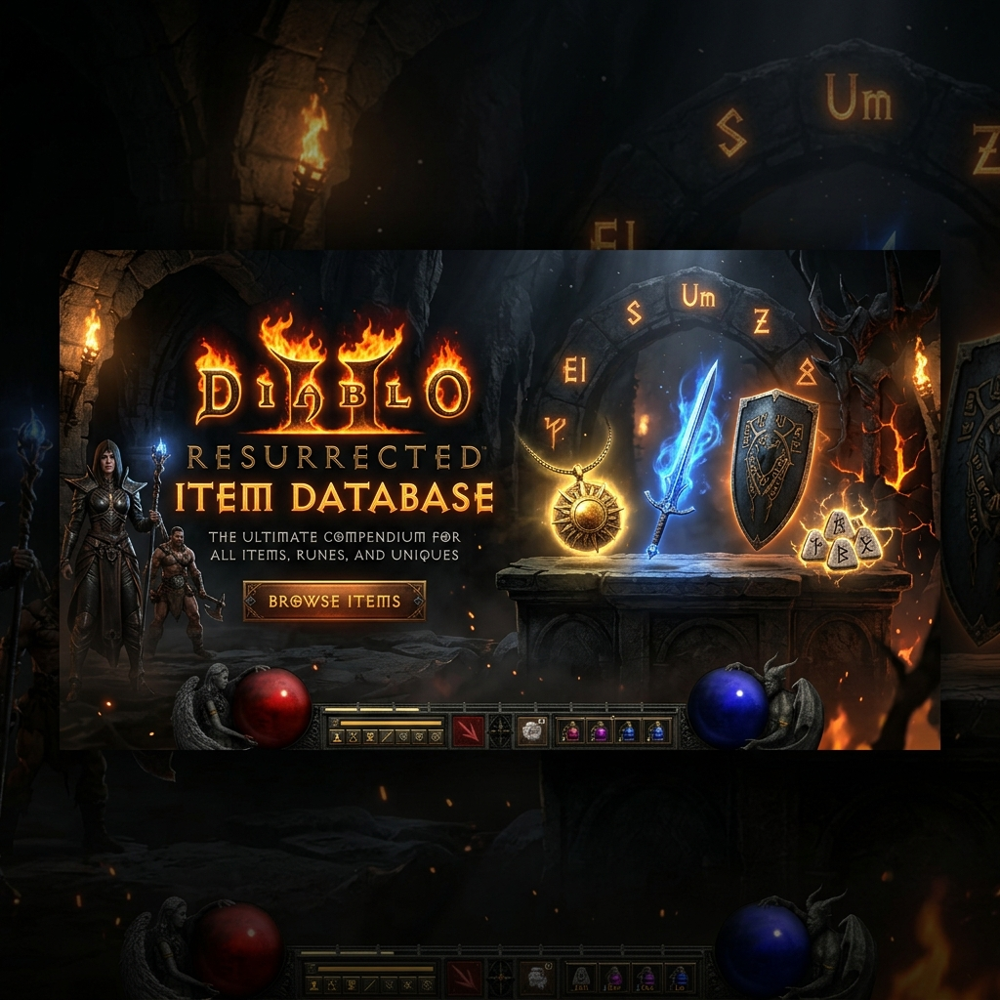

<div align="center">
  
  
  # ⚔️ D2R Item Database (D2R物品数据库)
  
  *A comprehensive web-based item database and inventory management system for Diablo 2 Resurrected.*

  [](https://www.python.org/)
  [](https://flask.palletsprojects.com/)
  [](https://www.sqlite.org/)
  [](LICENSE)
</div>

---

## ✨ Features

- 🔍 **Item Query**: Search and browse across thousands of weapons, armor, unique items, set items, runes, gems, and misc items.
- 📦 **My Items**: Track your personal item inventory across multiple battle.net accounts.
- 👥 **Account & Character Management**: Effortlessly manage multiple battle.net accounts and their characters.
- 📸 **OCR Support**: Extract item information directly from your screenshots using EasyOCR or the Google Gemini API.
- 🌐 **Bilingual UI**: Seamless, full support for Chinese (中文) and English interfaces.

## 📊 Data Source

All item data is meticulously sourced from [ZHIQUANLIU/D2R-Excel](https://github.com/ZHIQUANLIU/D2R-Excel), a comprehensive Diablo 2 Resurrected data repository.

## 🛠️ Tech Stack

- **Backend**: Python with Flask
- **Database**: SQLite
- **OCR Engine**: EasyOCR / Google Gemini API
- **Frontend**: Custom HTML/CSS (Responsive Design)

---

## 🚀 Installation & Setup

1. **Install dependencies:**
```bash
pip install flask easyocr
```

2. **(Optional) Obtain Gemini AI API key** 
   For enhanced OCR capabilities, get an API key from [Google AI Studio](https://aistudio.google.com/app/apikey).

3. **Initialize the database:**
```bash
python import_db.py
```

## 🎮 Usage Guide

1. Start the Flask server:
```bash
python app.py
```

2. Open your web browser and navigate to `http://localhost:5000`
3. Check and configure OCR settings at `/settings` (optional, but recommended for automation).
4. Add your accounts and characters at `/accounts`.
5. Start tracking your valuable loot at `/my-items/add`!

---

## 📁 Project Structure

```text
D2RItemDB/
├── app.py              # Main Flask application & UI
├── ocr_utils.py        # OCR utilities
├── import_db.py        # Database initialization script
├── settings.json       # User settings configuration
├── d2r_items.db        # Primary SQLite database
├── static/uploads/     # Uploaded item images & screenshots
├── images/             # Documentation visuals & banners
└── data/               # Core game data files
```

## 🗄️ Database Schema

| Table Name | Description |
|---|---|
| `weapons` | Weapon items |
| `armor` | Armor items |
| `unique_items` | Unique (暗金) items |
| `set_items` | Set (套装) items |
| `misc` | Miscellaneous items |
| `gems` | Gems |
| `runes` | Runes |
| `accounts` | Battle.net accounts |
| `characters` | User Characters |
| `my_items` | User's tracked items |
| `item_images` | Uploaded item screenshots |

---

## 📜 License

This project is licensed under the **MIT License**.
